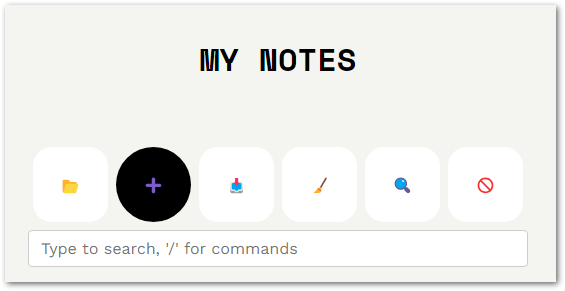

# MiniBlog

Welcome to **MiniBlog**, an intuitive web application for creating, managing, and exporting blog posts with ease. Whether you're a beginner or experienced blogger, MiniBlog helps you organize your thoughts and content in a streamlined, efficient way.

---

## Table of Contents

- [Features](#features)
- [Screenshots](#screenshots)
- [Usage](#usage)
  - [Adding a New Post](#adding-a-new-post)
  - [Editing a Post](#editing-a-post)
  - [Deleting a Post](#deleting-a-post)
  - [Exporting Your Blog](#exporting-your-blog)
  - [Importing Your Blog](#importing-your-blog)
  - [Using Commands](#using-commands)
  - [Customizing Appearance](#customizing-appearance)
  - [Clearing Settings](#clearing-settings)
- [License](#license)

---

## Features

- **Create, Edit, and Delete Posts**  
  Manage your blog posts with an easy-to-use interface.
  
- **Markdown Support**  
  Write rich content using Markdown for formatting.
  
- **Export and Import JSON**  
  Backup and transfer your blog data effortlessly.

- **Command Input with Autocomplete**  
  Use commands to streamline blog management.

- **Search and Navigate Posts**  
  Quickly find posts or navigate using the built-in search functionality.

- **Customizable Appearance**  
  Use the color picker to style your posts’ frames and adjust the interface to your liking.

---

## Screenshots

### Home Page

---

### Add Page Button

---

### Add Page Form

---

### Post Body Example

---

### Edit Post Buttons

---

### Export JSON Button

---

### Import JSON Button

---

### Command Input Autocomplete

---

### Color Picker for Frames

---

## Usage

### Adding a New Post

1. **Click the "Add Page" Button**  
   Use the ➕ button to open the add page form.

   

2. **Fill Out the Form**  
   - Add a picture URL, or leave it blank for a default image.
   - Choose a frame color using the color picker.
   - Write a title, description, and Markdown-formatted body.

   

3. **Save the Post**  
   Click the 💾 button to save your post.

---

### Editing a Post

1. **Locate the Post**  
   Find the post you want to edit in the list view.

2. **Click the Edit Button**  
   Use the ✏️ button to open the edit form.  

   

3. **Save Your Changes**  
   Make updates and save with the 💾 button.

---

### Deleting a Post

1. **Locate the Post**  
   Select the post you wish to delete.

2. **Click the Delete Button**  
   Use the 🗑️ button to delete the post.

---

### Exporting Your Blog

1. **Click the Export Button**  
   Use the 📥 button to export all your blog data to a JSON file.  

   

---

### Importing Your Blog

1. **Click the Import Button**  
   Use the 📂 button to upload a previously exported JSON file.  

   

---

### Using Commands

1. **Type "/" in the Command Input**  
   Start typing "/" to see autocomplete suggestions for commands.

   

2. **Select a Command**  
   Use arrow keys to select a command and press Enter.

---

### Customizing Appearance

- Use the color picker to style post frames and adjust colors to match your theme.  

   

---

### Clearing Settings

1. **Click the Clear Button**  
   Use the 🧹 button to clear all local settings and data.

   

---

## License

MiniBlog is licensed under the [MIT License](LICENSE).

*Made with ❤️ by [Your Name](https://github.com/garbledhamster)*
