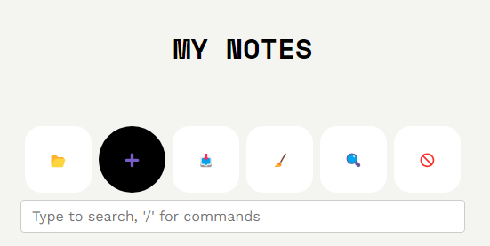
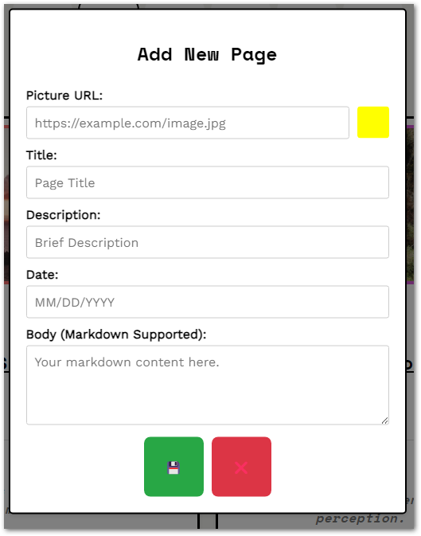
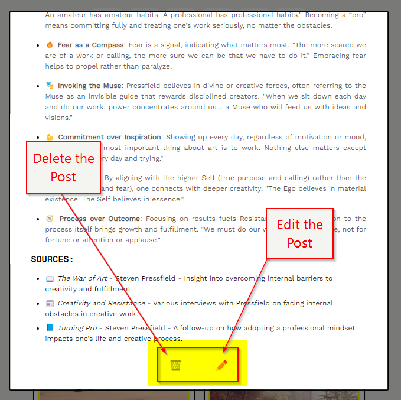
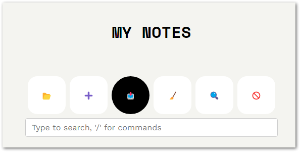
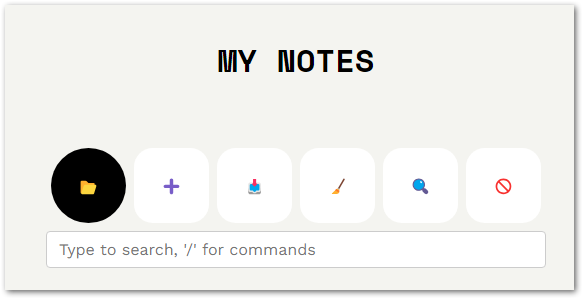
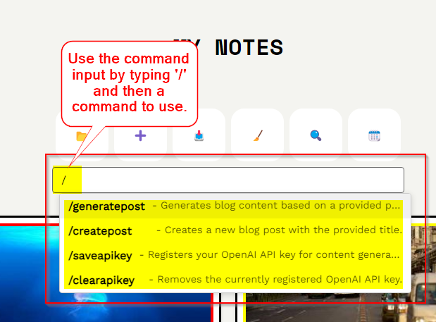
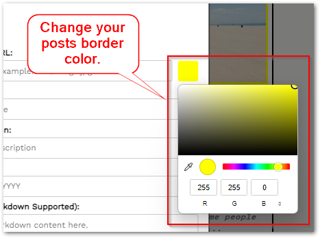
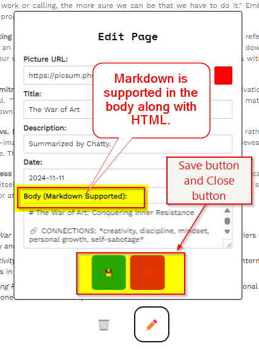
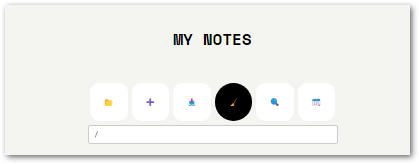
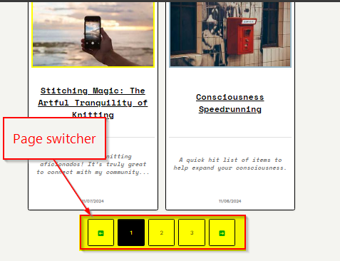

# MiniBlog

Welcome to **MiniBlog**, an intuitive web application for creating, managing, and exporting blog posts with ease. Whether you're a beginner or experienced blogger, MiniBlog helps you organize your thoughts and content in a streamlined, efficient way.

Access the live application here: [**MiniBlog Live Demo**](https://garbledhamster.github.io/MiniBlog/)

---

## Table of Contents

- [Features](#features)
- [Screenshots](#screenshots)
- [Usage](#usage)
  - [Adding a New Post](#adding-a-new-post)
  - [Editing a Post](#editing-a-post)
  - [Deleting a Post](#deleting-a-post)
  - [Exporting Your Blog](#exporting-your-blog)
  - [Importing Your Blog](#importing-your-blog)
  - [Using Commands](#using-commands)
  - [Customizing Appearance](#customizing-appearance)
  - [Clearing Settings](#clearing-settings)
- [Detailed Functionality](#detailed-functionality)
  - [Editable Title](#editable-title)
  - [Command Autocomplete](#command-autocomplete)
  - [Body Textarea Autocomplete](#body-textarea-autocomplete)
  - [Pagination and Sorting](#pagination-and-sorting)
  - [Markdown Support and Internal Linking](#markdown-support-and-internal-linking)
  - [Local Storage Management](#local-storage-management)
  - [OpenAI API Integration](#openai-api-integration)
- [License](#license)

---

## Features

- **Create, Edit, and Delete Posts**  
  Manage your blog posts with an easy-to-use interface.

- **Markdown Support**  
  Write rich content using Markdown for formatting.

- **Export and Import JSON**  
  Backup and transfer your blog data effortlessly.

- **Command Input with Autocomplete**  
  Use commands to streamline blog management.

- **Search and Navigate Posts**  
  Quickly find posts or navigate using the built-in search functionality.

- **Customizable Appearance**  
  Use the color picker to style your posts’ frames and adjust the interface to your liking.

---

## Screenshots

### Home Page


---

### Add Page Button


---

### Add Page Form


---

### Post Body Example


---

### Edit and Delete Post Buttons


---

### Export JSON Button


---

### Import JSON Button


---

### Command Input Autocomplete


---

### Color Picker for Frames


---

## Usage

### Adding a New Post

1. **Click the "Add Page" Button**  
   On the main interface, locate the control panel at the top. Click the **➕** (Add New Post) button to open the add page form.

   

2. **Fill Out the Form**  
   In the **Add New Page** form, provide the following details:
   - **Picture URL (optional):** Enter the URL of an image to associate with your post. If left blank, a random image will be used.
   - **Background Color:** Use the color picker to choose a background color for the image container.
   - **Title:** Enter a descriptive title for your post.
   - **Description:** Write a brief summary or introduction.
   - **Date:** Specify the date. Defaults to today's date if left blank.
   - **Body:** Compose your post content using Markdown syntax for formatting.

   

3. **Save the Post**  
   Once all fields are filled, click the **💾** (Save) button to add the post to your blog. Your post will now appear in the list of posts.

---

### Editing a Post

1. **Locate the Post**  
   Scroll through the **Latest Grid** to find the post you wish to edit.

2. **Click the Edit Button**  
   On the post card, click the **✏️** (Edit) button to open the edit form.

   

3. **Modify the Details**  
   Update any of the post details in the form that appears. You can change the image, title, description, date, or body content.

   

4. **Save Your Changes**  
   Click the **💾** (Save) button to apply your changes.

---

### Deleting a Post

1. **Locate the Post**  
   Find the post you want to remove in the **Latest Grid**.

2. **Click the Delete Button**  
   Click the **🗑️** (Delete) button on the post card.

   

3. **Confirm Deletion**  
   A confirmation dialog will appear. Click **OK** to confirm and delete the post.

---

### Exporting Your Blog

1. **Click the Export Button**  
   In the control panel at the top, click the **📥** (Export JSON) button to save your blog data.

   

2. **Download the JSON File**  
   A JSON file containing your blog posts will be downloaded to your device.

---

### Importing Your Blog

1. **Click the Import Button**  
   Click the **📂** (Load JSON) button in the control panel.

   

2. **Select the JSON File**  
   Choose the JSON file you previously exported or any compatible blog data file.

3. **Load the Data**  
   The blog data from the file will be loaded into the application, and your posts will appear in the **Latest Grid**.

---

### Using Commands

The command input allows you to perform actions quickly using slash commands.

1. **Access the Command Input**  
   Locate the command input field in the control panel.

2. **Type a Command**  
   Start by typing `/` to see available commands. As you type, an autocomplete suggestion box will appear.

   

3. **Select a Command**  
   Use the arrow keys to navigate the suggestions and press **Enter** to select.

4. **Execute the Command**  
   Follow the command syntax to execute actions like creating posts or saving API keys.

---

### Customizing Appearance

1. **Adjust Frame Colors**  
   Use the color picker in the add/edit form to change the background color of the image container for each post.

   

2. **Zoom and Sort**  
   - **Zoom:** Click the **🔍** (Zoom) button to cycle through zoom levels (75%, 100%, 125%, 150%).
   - **Sort:** Click the **🚫** (Sort) button to sort posts by date, name, or color.

   

---

### Clearing Settings

1. **Click the Clear Button**  
   If you wish to reset the application, click the **🧹** (Clear All) button in the control panel.

   

2. **Confirm Clearing**  
   A confirmation dialog will appear. Click **OK** to clear all data from local storage.

---

## Detailed Functionality

### Editable Title

- **Inline Editing:**  
  Double-click on the main blog title at the top to edit it. After editing, press **Enter** or click outside the input field to save the new title.

  

- **Local Storage Sync:**  
  The blog title is saved in local storage and persists across sessions.

### Command Autocomplete

- **Accessing Commands:**  
  In the command input field, type `/` to initiate command autocomplete.

  

- **Available Commands:**
  - `/createpost 'Your Title Here'`  
    Creates a new post with the specified title.
  - `/generatepost 'Your Prompt Here'`  
    Generates a post based on the provided prompt using OpenAI's API.
  - `/saveapikey 'Your_API_Key_Here'`  
    Saves your OpenAI API key for content generation.
  - `/clearapikey`  
    Clears the saved OpenAI API key.

- **Autocomplete Navigation:**  
  Use arrow keys to navigate suggestions and press **Enter** to select.

### Body Textarea Autocomplete

- **Internal Linking:**  
  When editing the body of a post, typing `[[` triggers an autocomplete for existing post titles.

  - **Insert Links:**  
    Select a post from the suggestions to insert a link in the format `[[Post Title]]`.

  - **Backlinks (Shift Key):**  
    Holding the **Shift** key while selecting a suggestion creates a mutual backlink between the current post and the selected one.

### Pagination and Sorting

- **Pagination Controls:**  
  Navigate between pages of posts using the pagination buttons at the bottom of the **Latest Grid**.

  

- **Sorting Options:**  
  - **No Sorting (Default):** Posts are displayed in the order they were added.
  - **Sort by Date:** Click the sort button until the **🗓️** icon appears.
  - **Sort by Name:** Click until the **🔡** icon appears.
  - **Sort by Color:** Click until the **🎨** icon appears.

### Markdown Support and Internal Linking

- **Markdown Syntax:**  
  Use Markdown to format your post content. This includes headers, lists, bold, italics, links, images, code blocks, and more.

- **Internal Links:**  
  Link to other posts by using `[[Post Title]]` in your content. These are processed into clickable links that navigate to the linked post when clicked.

- **Backlinks:**  
  Posts keep track of which other posts link to them, facilitating easy navigation between related content.

### Local Storage Management

- **Data Persistence:**  
  All your posts and settings are stored in your browser's local storage, ensuring data is retained between sessions.

- **Data Clearing:**  
  Use the **🧹** (Clear All) button to remove all stored data if needed.

- **Storage Info:**  
  The application displays storage usage information at the bottom, helping you manage your local storage effectively.

### OpenAI API Integration

- **Content Generation:**  
  Use the `/generatepost 'Your Prompt Here'` command to generate post content using OpenAI's API.

  - **Example:**  
    ```
    /generatepost 'Write a blog post about the benefits of remote work.'
    ```

- **API Key Management:**  
  - **Save API Key:**  
    Save your OpenAI API key using the command:
    ```
    /saveapikey 'sk-your_api_key_here'
    ```
  - **Clear API Key:**  
    Remove the saved API key with:
    ```
    /clearapikey
    ```
  - **Security Note:**  
    Your API key is stored in local storage and used only within your browser. Ensure you trust the environment before saving sensitive information.

- **Error Handling:**  
  The application provides feedback if there's an error during content generation, such as invalid API keys or network issues.

---

## License

MiniBlog is licensed under the [MIT License](LICENSE).

*Made with ❤️ by [Joseph R](https://github.com/garbledhamster)*
